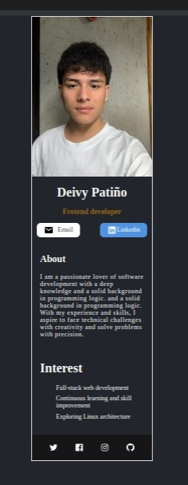

# Deivy Patiño Rodriguez

# Tarjeta Digital - Reto #4

Este proyecto es parte del reto #4 del curso, donde el objetivo es desarrollar una tarjeta digital utilizando ReactJs y comprender la interacción entre componentes dentro de una arquitectura básica.

## Descripción

El proyecto consiste en la creación de una tarjeta digital con la informacion propia

Separa los componentes de la siguiente manera:

- Info (Foto, Nombre, Botones)
- About
- Interest
- Footer

## Captura de Pantalla

## Ejecutar App

1. Instala las dependencias:

- npm install

2. Correr aplicación:

- npm run dev

## Enlace a la Aplicación Desplegada

https://deiiivy.github.io/digital-card/

